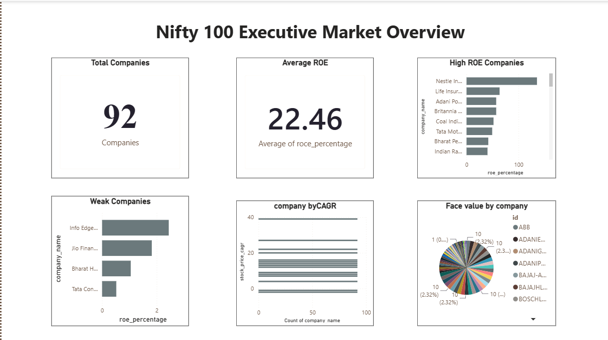
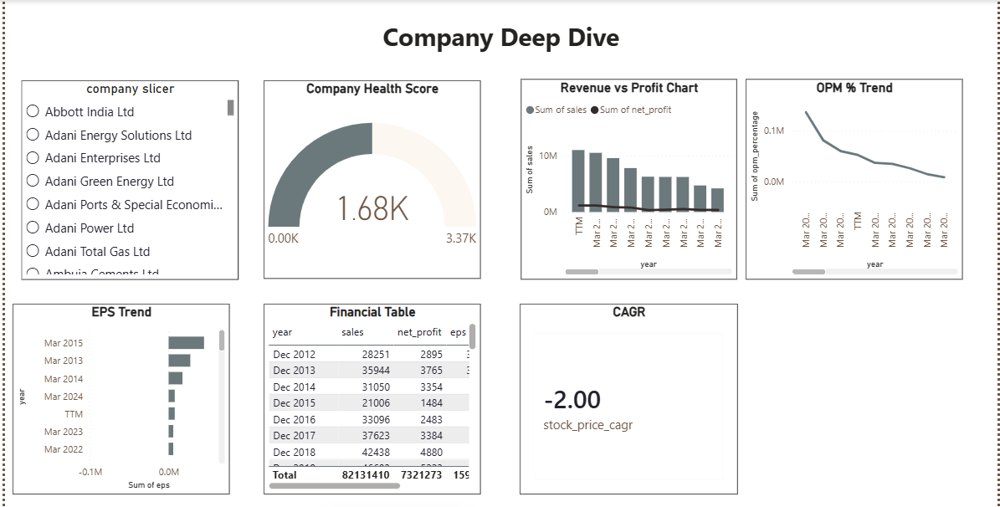
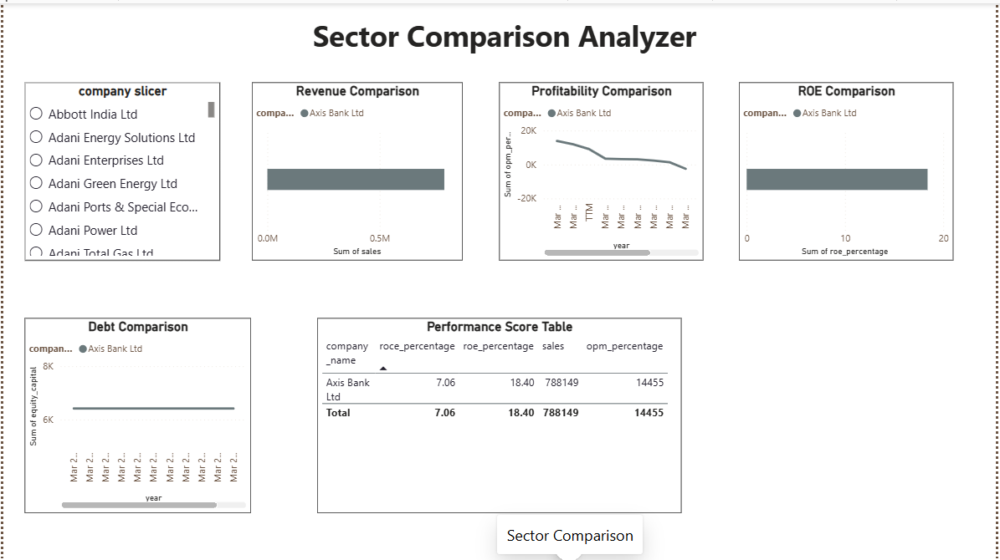
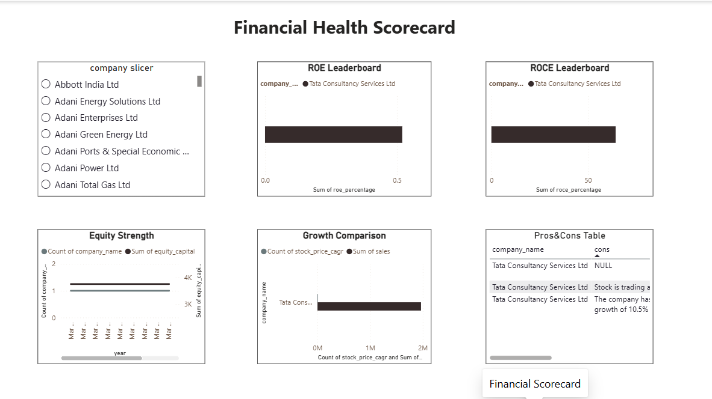
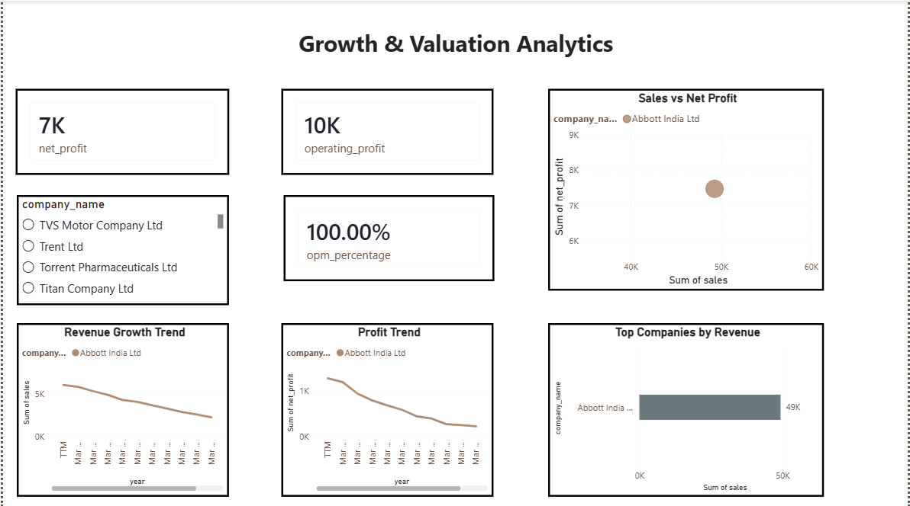
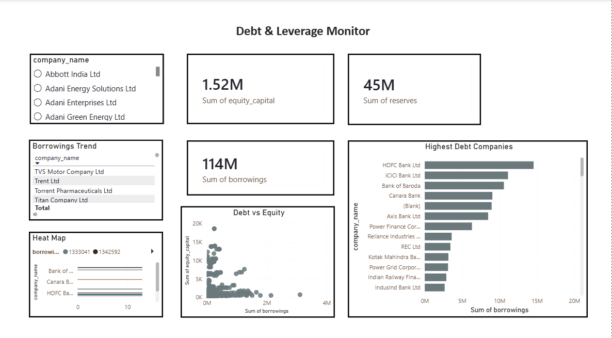
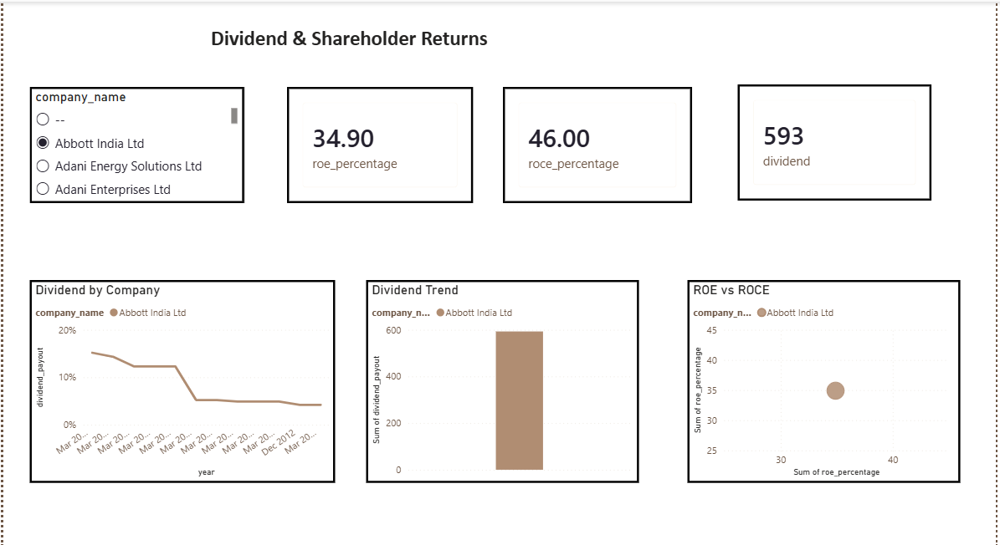

# 📈 Nifty100 Stock Market Analytics Dashboard

A comprehensive Power BI dashboard built to analyze the financial performance of Nifty 100 companies. This project transforms raw financial datasets into interactive visualizations, enabling investors and analysts to evaluate company health, profitability, growth, debt, and shareholder returns.

---

## 📌 Project Overview

This project was developed as part of a Data Analytics internship.

The dashboard provides insights into:

- Company Financial Health
- Revenue & Profit Growth
- Sector-wise Performance
- Debt & Leverage Analysis
- Dividend & Shareholder Returns
- Company Comparison
- Executive Market Overview

The goal was to convert complex financial data into meaningful business insights using Power BI.

---

## 📂 Repository Structure

```
📦 Nifty100-stock-market-analytics
│
├── Dashboard.pbix              # Power BI Dashboard
├── Data/                       # Financial datasets
├── README.md
```

---

## 📊 Dashboard Features

### 1. Executive Market Overview
- Total Companies
- Average Return on Equity (ROE)
- Health Score Distribution
- Sector Distribution
- Top Performing Companies
- Lowest Growth Companies

---

### 2. Company Deep Dive
- Company Selector
- Health Score
- Revenue vs Profit
- EPS Trend
- Operating Profit Margin
- Key Financial Metrics

---

### 3. Sector Comparison
- Sector-wise Revenue
- Profitability Comparison
- Leverage Comparison
- Financial Score Matrix

---

### 4. Financial Health Scorecard
- Company Health Ranking
- Health Score Distribution
- Companies Requiring Attention
- Sector-wise Health Analysis

---

### 5. Growth & Valuation Analytics
- Revenue Growth
- Profit Growth
- Growth Rate Comparison
- CAGR Analysis

---

### 6. Debt & Leverage Monitor
- Debt-to-Equity Analysis
- Borrowings Trend
- Debt-Free Companies
- Interest Coverage

---

### 7. Dividend & Shareholder Returns
- Dividend Payout Ratio
- Consistent Dividend Payers
- EPS Growth vs Dividend Payout
- Dividend Trends

---

## 🛠️ Tools & Technologies

- Power BI Desktop
- Microsoft Excel
- Data Modeling
- DAX
- Power Query
- Interactive Visualizations

---

## 📈 Key Skills Demonstrated

- Data Cleaning
- Data Modeling
- Dashboard Design
- Business Intelligence
- Financial Analysis
- KPI Development
- Interactive Reporting
- Data Visualization

---

## 📊 Dataset

The dataset contains financial information of Nifty 100 companies including:

- Revenue
- Profit
- ROE
- EPS
- Operating Profit Margin
- Debt
- Borrowings
- Dividend Payout
- CAGR
- Health Score
- Sector Information

---

## 🎯 Business Objectives

- Analyze company performance
- Compare sectors
- Identify financially healthy companies
- Monitor debt and leverage
- Evaluate growth opportunities
- Track shareholder returns

---
## 📷 Dashboard Preview

### Executive Market Overview



---

### Company Deep Dive



---

### Sector Comparison



---

### Financial Health Scorecard



---

### Growth & Valuation Analytics



---

### Debt & Leverage Monitor



---

### Dividend & Shareholder Returns



---

## 🚀 Future Improvements

- Real-time stock market integration
- Power BI Service publishing
- Automated data refresh
- Forecasting and predictive analytics
- Advanced DAX measures
- Performance optimization

---

## 👩‍💻 Author

**Charitha C**

- 🎓 Final Year B.Tech (Computer Science & Engineering)
- 📊 Data Analytics Enthusiast
- 💻 Passionate about Business Intelligence & Data Visualization

---

## ⭐ If you found this project useful

Consider giving this repository a ⭐ to support the project.
